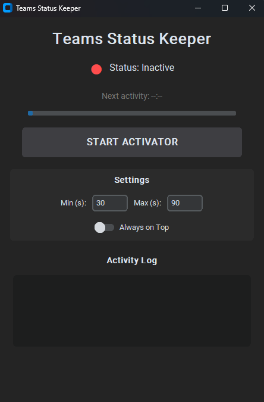

# Teams Status Keeper

A modern, standalone Windows application to prevent Microsoft Teams from automatically switching your status to "Away" during inactivity.



## 🚀 Features

- **Advanced Anti-Away**: Combines subtle mouse movements (1px) and keyboard simulation (Scroll Lock) to bypass strict inactivity detection.
- **Modern UI**: Sleek dark-mode interface built with `customtkinter`.
- **System Tray Integration**: Minimize the app to the tray to keep it running discretely.
- **Always on Top**: Maintain visibility of the activator status at all times.
- **Adjustable Intervals**: Customize the activity frequency directly in the UI.
- **Activity Log**: Real-time logging of simulated actions with timestamps.
- **Standalone EXE**: No Python installation required – just double-click and run.

## 🛠️ Usage

### Standalone Executable
1. Download `TeamsStatusKeeper.exe` from the latest release.
2. Double-click to run.
3. Configure your Min/Max intervals (Default is 30-90s).
4. Click **START ACTIVATOR**.

### Running from Source
If you prefer to run it using Python:
1. Clone the repository:
   ```bash
   git clone https://github.com/yourusername/teams-status-keeper.git
   cd teams-status-keeper
   ```
2. Install dependencies:
   ```bash
   pip install -r requirements.txt
   ```
3. Run the application:
   ```bash
   python TeamsStatusKeeper.py
   ```

## 📦 Building the Executable
To build the `.exe` yourself:
```bash
python -m PyInstaller --noconfirm --onefile --windowed --collect-all customtkinter TeamsStatusKeeper.py
```

## 🧠 Why this project?
Microsoft Teams typically marks users as "Away" after 5 minutes of inactivity. This tool ensures your status remains "Available" by simulating natural-like activity in the background, allowing you to stepped away from your desk without being flagged as inactive.

## ⚖️ License
This project is for educational purposes. Use responsibly and in accordance with your organization's policies.
